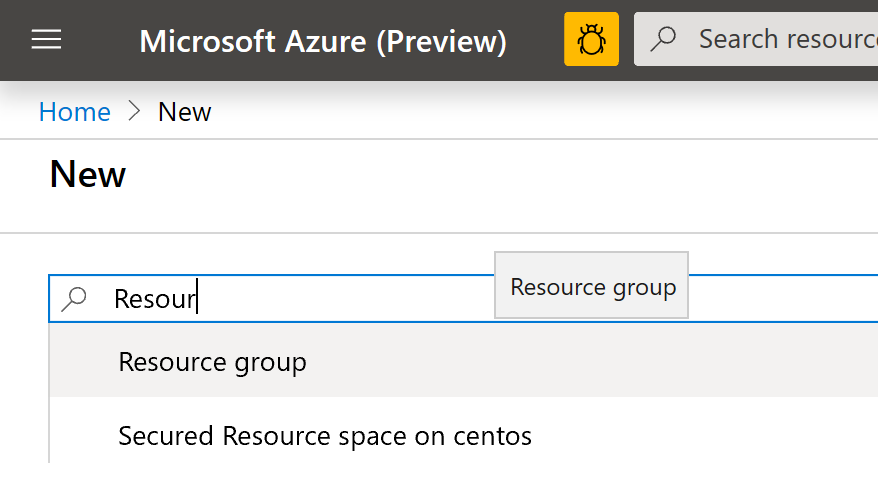

# Azure Data Factory et procedure stockée (Azure SQL Database)

Lors d'un projet avec un client, une étape consistait à transformer des fichiers, déposés dans un stockage blob, à l'aide d'une procédure stockée existante, puis de déplacer le résultat dans un stockage "Azure Files".

Cet article a pour but de partager les différentes étapes pour réaliser ce pipeline de transformation et ainsi que les différentes astuces utilisées pour mener à bien cette partie du projet


## Pré requis

- [Un abonnement Azure](https://azure.microsoft.com/fr-fr/free/)
- [Azure Storage Explorer](https://azure.microsoft.com/en-us/features/storage-explorer/) 


# Création des services Azure
## Création d'un groupe de ressources
Nous allons commencer par créer un groupe de ressouces afin d'héberger les différents services de notre solution de transcription de fichiers audio.

Depuis le portail [Azure](https://portal.azure.com), cliquez sur "**Create a resource**"


 Puis, recherchez "**Resource group**"

 


Cliquez sur le bouton "**Create**"


Dans le champ "**Resource group**", donnez un nom à votre groupe de ressources. Cliquez sur le bouton "**Review + Create**"


Dans l'écran de validation, cliquez sur le bouton "**Create**"


Revenez à l'accueil du portail Azure. Cliquez sur le menu burger en haut à gauche puis sur "**Resource** **groups**"


Cliquez sur le groupe de ressources créé précédement


## Création du compte de stockage

Une fois dans le groupe de ressources, cliquez sur le bouton "**Add**"


Recherchez le compte de stockage


Cliquez sur le bouton "**Create**"


Complétez la création du compte de stockage et cliquez sur "**Review** + **create**"


Après avoir vérifié les informations de création du compte de stockage, cliquez sur le bouton "**Create**"


## Création d'une base de données Azure SQL
Ici, nous allons créer une base de données uniquement pour héberger et exécuter notre procédure stockée. Vous pouvez donc, si vous le souhiatez, utiliser une base de données Azure éxistante.

Retournez dans le groupe de ressources. Vous devez avoir votre compte de stockage comme première resource.

Cliquez sur le bouton "**Add**"


Puis, recherchez "**Azure SQL**" 


Cliquez sur le bouton **Create**


Choisissez **SQL Database** puis cliquez sur le bouton **Create**


Choisissez le groupe de ressouces précédement créé, définissez le nom de la base de données et créez un nouveau server SQL (il est aussi possible d'utiliser un serveur existant)

Un tier **Basic** sera largement suffiment pour notre démonstration

Cliquez sur le bouton **"Review + create"**


Cliquez sur le bouton **"Create"**


Après le déploiement de votre base de données Azure SQL et du server Azure SQL vous devez avoir 3 services dans votre groupe de ressources


## Création du service Azure Data Factory (ADF)

Dans votre groupe de ressources, cliquez sur le bouton **" + Add"**


Dans la barre de recherche entrez **"Data Factory"**


Puis cliquez sur le bouton **"Create"**


Vérifiez que vous avez bien sélectionné le bon groupe de ressources et donnez un nom à votre service ADF.

Sélectionnez **"V2"** pour la version.

Cliquez sur le bouton **"Next: Git configuration "**


Cochez la case **"Configure Git Later"** et cliquez sur le bouton **"Review + create"**


Dans la page de validation, ciquez sur le bouton **"Create"**


Après la création du service Azure Data Factory, vous devriez avoir 4 services dans votre groupe de ressources


## Préparation de la procédure stockée.

Dans notre exemple, la procédure stockée va lire des données dans un stockage blob et effectuer des transformations. Les transformations réalisées ici seront extrêmement basiques. Le but ici est d'illustrer l'utilisation des procédures stockées avec Azure Data Factory.

### Paramètrage du serveur Azure SQL

Configurez le Firewall du serveur Azure SQL afin de pouvoir vous y connecter avec des outils comme SQL Server Management Studio ou Azure Data Studio

Depuis le portail Azure, sélection votre serveur Azure SQL, puis cliquez sur **"Firewalls and virtual networks"**

Saisissez les adresses ip nécessaires.


Après configuration des adresses ip, cliquez sur le bouton **"Save"**


### Crétion du fichier de format

La procédure stockée va utiliser la fonction [OPENROWSET](https://docs.microsoft.com/fr-fr/sql/t-sql/functions/openrowset-transact-sql?view=sql-server-ver15). Et comme on souhaite récupérer les informations du fichier dans le but de faire des opérations sur les données, nous avons besoin de définir un [fichier de format](https://docs.microsoft.com/en-us/sql/t-sql/functions/openrowset-transact-sql?view=sql-server-ver15).

Le format des fichiers que nous allons traiter pour cet exemple est très simple. Il est constitué de 3 colonnes :

- Nom
- Prénom
- Vente

La création du fichier de format va se faire en 3 étapes

- Création d'une table SQL correspodant au format du fichier
- Utilisation de l'outil BCP pour créer le fichier de format
- Téléchargement du fichier dans le compte de stockage


#### Création de la table SQL

Avec [Azure Data Studio](https://docs.microsoft.com/fr-fr/sql/azure-data-studio/download-azure-data-studio?view=sql-server-ver15), connectez vous à votre base Azure SQL, avec les touches **Ctrl** et **N** créé un nouveau fichier SQL


Puis copiez le script ci-dessous. Cliquez sur le bouton "Play"


CREATE TABLE [dbo].[MyFirstImport](
	[LastName] [varchar](30) NULL,
	[FirstName] [varchar](25) NULL,
	[Sales] [int] NULL
) ON [PRIMARY]
GO


Si tout se passe bien vous devriez avoir le message suivant et accès à votre table via le menu de gauche


### Création du fichier de format

Assurez-vous d'avoir la dernière version de l'outil BCP. Pour cet exemple, j'ai utilisé la [version 15](https://docs.microsoft.com/en-us/sql/tools/bcp-utility?view=sql-server-ver15).

Pour être certains d'utiliser la bonne version de l'outil BCP, allez dans le répertoire d'installation. Dans mon cas le répertoire est :

C:\Program Files\Microsoft SQL Server\Client SDK\ODBC\170\Tools\Binn

Puis utilisez la commande suivante (J'ai un répetoire *Temp* sur mon disque C:)

```javascript

bcp dbo.MyFirstImport format nul -c -x -f C:\Temp\format.xml -t, -U <Your User> -S tcp:<Your Server Name>.database.windows.net -d <Your Database name> -P <Your Password>

```

Une illustration ci-dessous :


Youd devez obtenir le ficier de format dans le répertoire spécifié avac la commande BCP


### Téléchargez le fichier format dans le compte de stockage Azure

Depuis le portail Azure, allez sur votre compte de stockage


Puis cliquez sur **"Containers"**


Et cliquez sur le bouton **"+ Container"**


Donnez un nom et cliquez sur le bouton **"Create"**


Nous allons créer un répertoire pour notre fichier de format.

Cliquez sur **"Storage Explorer (preview)"**, sélectionnez le conteneur créé précédement, puis cliquez sur **"New Folder"**


Donnez un nom au répertoire et cliquez sur le bouton **"Ok"**


Cliquez sur le bouton **"Upload"** et téléchargez le fichier de format précédement créé avec la fonction BCP.


Votre fichier est maintenant téléchargé.


### Préparation du partage de fichier

Depuis le portail Azure, sélectionnez votre compte de stockage puis cliquez sur **"File shares"**


Cliquez sur le bouton **"+ File share"**


Donnez un nom à votre partage de fichier puis cliquez sur le bouton **"Create"**


Vous devriez obtenir un résultat similaire à la copie d'écran ci-dessous :


## Création de la procédure stockée

Notre procédure stockée va lire des fichiers qui se trouvent dans notre compte de stockage et effectuer des opéations sur les données qu'elle va récupérer.

Il est donc néccessaire de faire des étapes préliminaires pour permettre à la procédure stockée d'accéder au compte de stockage

- Création d'une signature d'accès partagé (compte de stockage) [(Documentation)](https://docs.microsoft.com/fr-fr/azure/storage/common/storage-sas-overview)
- Création d'une clef principale de base de données [(Doucumentation)](https://docs.microsoft.com/fr-fr/sql/t-sql/statements/create-master-key-transact-sql?view=sql-server-ver15)

- Création des informations d'identification pour accéder au compte de stockage [(Documetation)](https://docs.microsoft.com/fr-fr/sql/t-sql/statements/create-database-scoped-credential-transact-sql?view=sql-server-ver15)
- Création d'une source externe [(Documentation)](https://docs.microsoft.com/fr-fr/sql/t-sql/statements/create-external-data-source-transact-sql?view=sql-server-ver15)


### Création d'une signature d'accès partagé (Compte de Stockage)

Depuis le portail Azure, allez dans votre compte de stockage puis cliquez sur **"Shared Access Signature"**.

Définissez les options de la signature d'accès partagé puis cliquez sur le bouton **"Generate SAS and connection string"**


Copiez le contenu du champ **"SAS Token"** puis gardez le sous la main, on va en avoir besoin un peu plus tard.


### Création d'une clef principale de base de données (Azure SQL)

Depuis Azure Data Studio, copiez la reqûete ci-dessous :

```javascript
CREATE MASTER KEY ENCRYPTION BY PASSWORD='<EnterStrongPasswordHere>';

```

Puis cliquez sur le bouton **Run**


### Création des informations d'identification pour accéder au compte de stockage

Depuis Azure Data Studio, exécutez le script ci-dessous :

**ATTENTION !!!!**, retirer le signe **"?"** après avoir copier votre signature d'accès partagé. 

```javascript
CREATE DATABASE SCOPED CREDENTIAL AccessAzureStorage
WITH
  IDENTITY = 'SHARED ACCESS SIGNATURE',
  -- Remove ? from the beginning of the SAS token
  SECRET = '<YOUR SHARED ACCESS SIGNATURE>' ;

```

Pour plus de clarté, voici une copie d'écran


### Création des informations d'identification pour accéder au compte de stockage 

Depuis Azure Data Studio, exécutez le script ci-dessous :

```javascript
CREATE EXTERNAL DATA SOURCE AzureStorageExternalData
WITH
  ( LOCATION = '<YOUR LOCATION>' ,
    CREDENTIAL = AccessAzureStorage ,
    TYPE = BLOB_STORAGE
  ) ;

```

Remplacez <YOUR LOCATION> par le chemin de votre conteneur. Cette information peut être retouvée dans le portail Azure, dans les propriétés de du conteneur


Ci-dessous une copie d'écran dans Azure Data Studio :


### Création de la procédure stockée

Dans Azure Data Studio, copiez le script ci-dessous :

```javascript
CREATE PROCEDURE Franmer
       @MyFileName nvarchar(MAX)
AS
BEGIN
       declare @query nvarchar(MAX)
       set @query = 'Select LastName, sum(Sales) as TotalSales FROM OPENROWSET(BULK ''' + @MyFileName + ''', 
       DATA_SOURCE = ''AzureStorageExternalData'',
       FORMAT=''CSV'',
       FORMATFILE=''Format/format.xml'',
       FORMATFILE_DATA_SOURCE = ''AzureStorageExternalData'') as products
       GROUP BY LastName;'
 
       EXEC sp_executesql @query
 END

```


Il est possible de tester la procédure stockée en téléchargeant le fichier d'exemple (qui se trouve dans le [github](https://github.com/franmer2/ADFandStoredProcedure/blob/master/Resources/test.csv)) à la racine du conteneur.


Puis dans Azure Data Studio, entrez le script ci-dessous:

```Javascript
EXECUTE franmer @MyFileName='test.csv'
```

Si tout se déroule comme prévu, vous devriez obtenir le résultat suivant :


## Création du pipeline Azure Data Factory

Depuis le portail Azure, retrouvez votre service Azure Data Factory, puis cliquez sur **"Author & Monitor"**


## Création des services liés
### Service lié Blob Storage

Une fois sur la pagge d'accueil d'AZure Data Factory, cliquez sur le bouton **"Manage"** à gauche de l'écran


Cliquez sur **"Linked services"** puis sur le bouton **"+ New"**  


Dans le liste des services liés, sélectionnez **"Azure Blob Storage"**


Donnez un nom au service lié, sélectionnez le compte de stockage puis testez la connexion en cliquant sur **"Test connection"** (1). Une fois le test réussi, cliquez sur le bouton **"Create"** (2).


### Service lié Azure File Storage

Créez un nouveau service lié de type **"Azure File Storage"**


Puis complétez les informations de connexion


### Service lié Azure SQL Database

Enfin, Créez un service lié de type **"Azure SQL Database"**


Puis complétez les informations de connexion


Vous devez avoir en tout 3 services liés


## Création du pipeline

Ci-dessous une vue globale du pipeline que nous allons créer 


### Création des "Datasets"
#### Création du "Blob Storage Dataset"

Nous allons commencer par créer nos *"Datasets"* afin d'accéder à notre procédure stockée. notre *"blob storage"* et le *"file storage"*

Dans la console Azure Data Factory, sur la gauche, cliquez sur le bouton **"+"** puis sur **"Dataset"**


Choisissez un *"Dataset"* de type **"Azure Blob Storage"** puis cliquez sur le bouton **"Continue"**


Choisissez le format **"DelimitedText"** puis cliquez sur le bouton **"Continue"**


Entrez les informations de votre stockage blob puis cliquez sur le bouton **"OK"**


Une fois le *"Dataset"* créé, cliquez sur **"Parameters"**, puis sur le bouton **"+ New"**. Donnez un nom au paramètre. Ici je vais nommer mon paramètre **"FileName"**


Cliquez sur l'onglet **"Connection"**, puis dans le champ **"File"**. Cliquez ensuite sur le lien **"Add dynamic content"**


Le volet **"Add dynamic content"** apparaît. rajoutez l'expression

```Javascript
 @dataset().FileName 
```

 Cliquez sur le bouton **"Finish"**


Notre premier *"Dataset"* est prêt. Cliquez sur le bouton **"Publish all"** et publiez le *"dataset"*


#### Création du "File Storage Dataset"

Dans la console Azure Data Factory, sur la gauche, cliquez sur le bouton **"+"** puis sur **"Dataset"**


Choisissez un *"Dataset"* de type **"Azure File Storage"** puis cliquez sur le bouton **"Continue"**


Choisissez le format **"DelimitedText"** puis cliquez sur le bouton **"Continue"**


Entrez les informations de votre stockage *"file"* puis cliquez sur le bouton **"OK"**


Une fois le *"Dataset"* créé, cliquez sur **"Parameters"**, puis sur le bouton **"+ New"** 3 fois afin de créer 3 paramètres. Donnez un nom aux paramètres 


Cliquez sur l'onglet **"Connection"**, puis dans le champ **"File"**. Cliquez ensuite sur le lien **"Add dynamic content"**


Le volet **"Add dynamic content"** apparaît. rajoutez l'expression

```Javascript
 @concat(dataset().Prefix,'-',dataset().Date,'-',dataset().Name,'.csv')
 ```
 
 Cliquez sur le bouton **"Finish"**


Cliquez sur le bouton **"Publish all"**


#### Création du "Dataset" Azure SQL Database

Dans la console Azure Data Factory, sur la gauche, cliquez sur le bouton **"+"** puis sur **"Dataset"**


Choisissez un *"Dataset"* de type **"Azure SQL Database"** puis cliquez sur le bouton **"Continue"**


Renseignez les données concerant Azure SQL puis cliquez sur le bouton **"OK"**


Cliquez sur le bouton **"Publish"**


### Création des activités du pipeline

Depuis le portail d'Azure Data Factory, cliquez sur le bouton **"+"** puis sur **"Pipeline"**


Au niveau de votre pipeline, créez un nouveau paramètre. Dans l'onglet **"Parameters"**. Cliquez sur le bouton **"+ New"** puis puis donnez un nom au paramètre


Cliquez ensuite sur l'onglet **"Variables"** afin de rajouter une variable pour capturer la date. Cliquez sur le bouton **"+ New"** puis puis donnez un nom à la variable


Comme nous avons une contrainte fonctionnelle au niveau du nom du fichier, qui doit comporter la date dans son nom, nous devons la capturer au début du pipeline afin de s'assurer d'avoir la même valeur durant l'exécution du pipeline.


De plus, comme la destination de la copie est un *"File storage"*, il va falloir formater la date afin de ne conserver que des caractères supportés par le *"File storage"*.

Rajoutez une activité **"Set variable"** dans votre pipeline, qui se trouve dans la rubrique **"General"**. Puis cliquez sur l'onglet **"Variables"**. Dans la liste déroulante **"Name"**, choisissez la variable **"Date"**, cliquez dans le champ **"Value"**, puis cliquez sur **"Add dynamic content"**


Dans le volet **"Add dynamic content"**, rajoutez la fonction 

```Javascript
@formatDateTime(utcnow(),'yyyy-MM-ddTHH-mm-ss')
```


Cliquez sur le bouton **"Finish"**


Depuis le volet **"Activities"**, dans la rubrique **"Move and transform"**, rajoutez l'activité **"Copy data"** dans votre pipeline juste après l'activité **"Set variable 1"** 


Cliquez sur l'onglet **"Source"**. Dans la liste déroulante **"Source Dataset"**, sélectionnez votre *"Dataset"* Azure SQL. Puis cliquez sur **"Stored pocedure"**, et sélectionnez votre procédure stockée dans la liste déroulante **"Name"**.

Cliquez ensuite sur le bouton **"Import parameter"** afin de récupérer le paramètre de la procédure stockée. Cliquez dans le champ **"Value"** pour faire apparaître le lien **"Add dynanic content"**. Cliquez sur ce lien.


Dans le volet **"Add dynanic content"**, rajoutez l'expression 

```Javascript
@pipeline().parameters.FileName
```


Cliquez sur le bouton **"Finish"**.


Cliquez sur l'onglet **"Sink"**. Dans la liste déroulante **"Sink dataset"**, sélectionnez le dataset du *"File storage"*. Pour chacun des paramètres, rajoutez les valeurs suivantes, à chaque fois en cliquant sur le lien **"Add dynamic content"**

Pour le paramètre **"Prefix"** rajoutez l'expression

```Javascript
@pipeline().parameters.FileName
```

Pour le paramètre **"Date"** rajoutez l'expression

```Javascript
@variables('Date')
```


Pour le paramètre **"Name"** rajoutez l'expression que vous souhaitez. Ici pour illustrer cet exemple je vais tout simplement mettre la valeur **MonParamètre**.


Voici ce que va donner la partie **"Sink"** de l'activité de copie


Nous allons enfin rajouter une activité **"Delete"** afin de le *"blob storage"* après l'exécution du pipeline.

Depuis le volet **"Activities"**, dans la rubrique **"General"**, rajoutez l'activité **"Delete"** dans votre pipeline


Cliquez sur l'onglet **"Source"**. Sélectionnez le *"dataset"* correspondant au *"blob storage"*. Cliquez dans le champ **"value"** correspondant au paramètre puis cliquez sur **"Add dynamic content"**.


Dans le volet **"Add dynamic content"**, rajoutez l'expression

```Javascript
@pipeline().parameters.FileName
```

Puis cliquez sur le bouton **"Finish"**


Cliquez sur l'onglet **"Logging settings"** pour désactiver le logging en décochant la case **"Enable logging"**. On ne va pas en avoir besoin pour cet exemple.


Cliquez sur le bouton **"publish"**


#### ajout d'un déclencheur de type évènement


Nous allons maintenant rajouter un déclencheur pour que le pipeline se déclenche dès qu'un nouveau fichier arrive.

Cliquez sur **"Add trigger"** puis sur **"New/Edit"**


dans la fenêtre **"Add trigger"**, dans la liste déroulante, cliquez sur **"+ New"**


Dans la rubrique **"Type"** sélectionnez **"Event"**. Puis donnez les informations de connexion à votre compte de stockage. Comme nous allons surveiller l'arrivée des fichiers à la racine du conteneur, nous allons laisser le champ **"Blob path begins with"** vide.

=======================================

**ATTENTION !!!** Le déclencheur va surveiller l'ensemble du conteneur, ce qui veut dire que si un fichier csv arrive dans un sous dossier, le pipeline sera déclenché.
Dans le cas où vous souhaitez surveiller un dossier bien particulier, et ainsi isoler le traitement des fichiers dans une zone précise de votre conteneur, vous pouvez tout simplement mettre le nom du répertoire à surveiller). 


=======================================


Dans le chanp **"Blob path ends with"**, nous allons indiquer l'extension des fichiers que l'on souhaite traiter. Ici on indiquera **".csv"**

Dans la rubrique **"Event"**, cliquez sur **"Blob created"**. Cliquez sur le bouton **"Continue"**


Si vous avez déjà des fichiers csv dans votre compte de stockage, ils devraient être affichés dans cette fenêtre. C'est aussi un bon moyen de vérifier la syntaxe utilisé dans les champs **"Blob path begins with"** et **"Blob path ends with"** du volet précédent. Cliquez sur le bouton **"Continue"**.


Dans le volet **"Trigger run paramètre"**, il est possible de définir une valeur au paramètre de notre pipeline. C'est ce que nous allons faire avec l'expression suivante :

```Javascript
@trigger().outputs.body.fileName
```

Cliquez sur le bouton **OK"**


Puis publiez le pipeline en cliquant sur le bouton **"Publish all"**


### Test du pipeline

Téléchargez le fichier d'exemple dans votre conteneur Blob. Par exemple avec Azure Storage Explorer


Puis ensuite, aller dans votre stockage *"file storage"* pour vérifier si un fichier est présent avec la bonne nomenclature au niveau de son nom


Vérifiez aussi si le fichier à bien été effacé du stockage blob en fin d'exécution du pipleine


Du côté du portail Azure Data Factory, vous pouvez monitorer la bonne exécution du déclencheur et du pipeline en allant dans **"Monitor"** puis **"Trigger runs"** ou **"Pipeline runs"**

Ci dessous un exemple de monitoring du déclencheur


Si vous devez faire des tests de votre pipeline sans utilser le déclencheur, il est possible de l'arréter en allant dans **"Manage"**, **"Triggers"** puis en cliquant sur **"Deacticate"**

