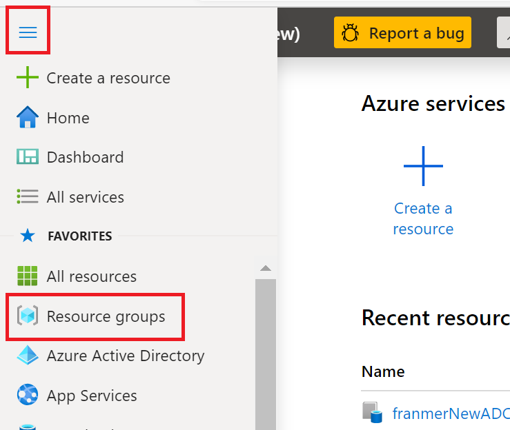
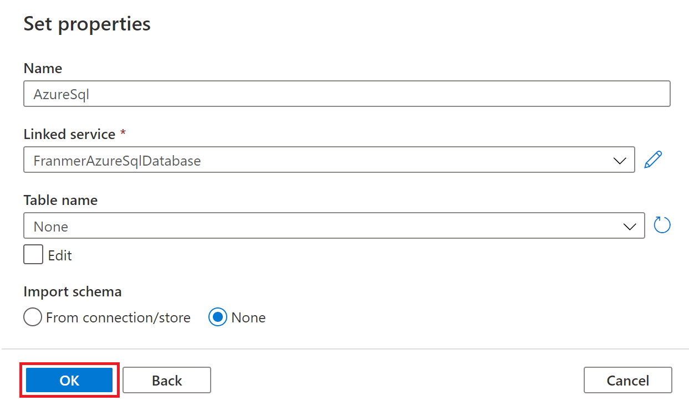
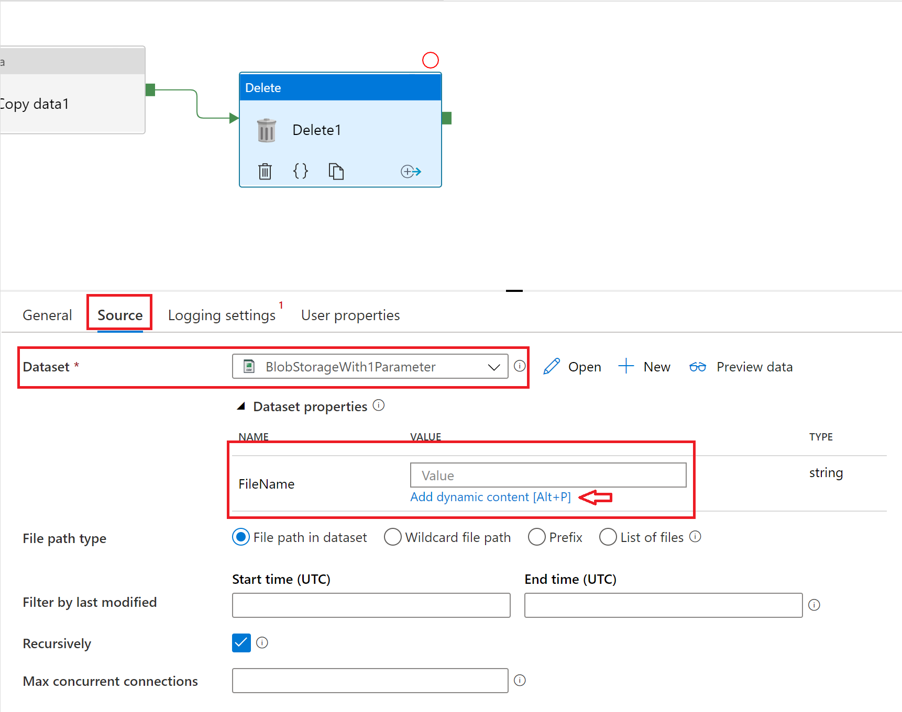

# Azure Data Factory et procedure stockée (Azure SQL Database)

In a project with a client, one step was to transform files, deposited in blob storage, using an existing stored procedure, and then move the result to an "Azure Files" storage. I found it interesting to use the copy activity with a stored procedure sourced.

This article aims to share the different steps to achieve this transformation pipeline and the various tricks used to carry out this part of the project.


## Prerequisite

- [An Azure subscription](https://azure.microsoft.com/fr-fr/free/)
- [Azure Storage Explorer](https://azure.microsoft.com/en-us/features/storage-explorer/) 


# Creating Azure services
## Resource group
We will start by creating a group of resources to host the different services of our solution.

From [Azure portal](https://portal.azure.com), click "**Create a resource**"


 Then, look for "**Resource group**"

 


Click "**Create**"


In the "**Resource group**" field, give a name to your resource group. Click on the "**Review + Create**" button


In the validation screen, click on the "**Create**" button


Return to the Azure portal home. Click on the burger menu at the top left then on "**Resource groups**"



Click on the resource group created previously


## Azure Storage account

Once in the resource group, click the button  "**Add**"


Search for storage account 


Click "**Create**"


Complete the account storage creation and click "**Review** + **create**"


After checking the storage account creation information, click the button "**Create**"


## Azure SQL database creation
Here we will create a database only to host and execute our stored procedure. So, if you wish, you can use an existing Azure database.

Go back to the resource group. You must have your storage account as your first resource.

Click "**Add**"


Then, look for "**Azure SQL**" 


Click **Create**


Select **SQL Database** then click **Create**


Choose the previously created resource group, set the name of the database and create a new SQL server (it's also possible to use an existing server)

A **"Basic"** tier will be more than enough for our demonstration

Click **"Review + create"**


Click **"Create"**


After deploying your Azure SQL database and Azure SQL server you need to have 3 services in your resource group


## Azure Data Factory (ADF)

In your resource group, click **" + Add"**


In the search bar enter **"Data Factory"**


Then click **"Create"**


Make sure you've selected the right resource group and name your ADF service.

Select **"V2"**

Click **"Next: Git configuration "**


Check the **"Configure Git Later"** box and click **"Review + create"**


In the validation page, click**"Create"**


After creating the Azure Data Factory service, you should have 4 services in your resource group


## Preparing the stored procedure

In our example, the stored procedure will read data in blob storage and perform transformations. The transformations made here will be extremely basic. The aim here is to illustrate the use of procedures stored with Azure Data Factory.

### Azure SQL server setting

Set up the Azure SQL server Firewall so you can connect to it with tools like SQL Server Management Studio or Azure Data Studio

From the Azure portal, select your Azure SQL server, then click **"Firewalls and virtual networks"**

Enter the necessary ip addresses.


After setting up ip addresses, click the button **"Save"**


### File format creation process

The stored procedure will use the function [OPENROWSET](https://docs.microsoft.com/en-us/sql/t-sql/functions/openrowset-transact-sql?view-sql-server-ver15). And because we want to retrieve the information from the file in order to do data operations, we need to define a [format file](https://docs.microsoft.com/en-us/sql/t-sql/functions/openrowset-transact-sql?view-sql-server-ver15)..

The format of the files we will process for this example is very simple. It consists of 3 columns:

- Name
- First Name
- Sale

The creation of the format file will be done in 3 steps

- Creating a SQL table that matches the file format
- Using the BCP tool to create the format file
- Download the file to the storage account


#### SQL Table creation

With [Azure Data Studio](https://docs.microsoft.com/en-us/sql/azure-data-studio/download-azure-data-studio?view-sql-server-ver15), connect to your Azure SQL database, and then create a new SQL file with a combination of **"Ctrl"** and **"N"** keys.


Then copy the script below. Click on the **"Play"** button


```Javascript
CREATE TABLE [dbo].[MyFirstImport](
	[LastName] [varchar](30) NULL,
	[FirstName] [varchar](25) NULL,
	[Sales] [int] NULL
) ON [PRIMARY]
GO
```


If all goes well you should have the following message and access to your table via the menu on the left


#### Création du fichier de format

Make sure you have the latest version of the BCP tool. For this example, I used [version 15](https://docs.microsoft.com/en-us/sql/tools/bcp-utility?view-sql-server-ver15).

To make sure you're using the right version of the BCP tool, go to the installation directory. In my case the directory is:

C:\Program Files\Microsoft SQL Server\Client SDK\ODBC\170\Tools\Binn

Then use the following command (I have a **"Temp"** directory on my C drive)

```javascript

bcp dbo.MyFirstImport format nul -c -x -f C:\Temp\format.xml -t, -U <Your User> -S tcp:<Your Server Name>.database.windows.net -d <Your Database name> -P <Your Password>

```

See below:


You need to get the format file in the specified directory with the BCP command


#### Download the format file in the Azure storage account

From the Azure portal, go to your storage account


Click **"Containers"**


And click **"+ Container"**


Give a name and click **"Create"**


We will create a directory for our format file.

Click on **"Storage Explorer (preview),"** select the container created previously, and then click **"New Folder"**


Name the directory and click the button **"Ok"**


Click the **"Upload"** button and download the format file previously created with the BCP function.


The file is ready


### Azure File setup

From the Azure portal, select your storage account and click **"File shares"**


Click **"+ File share"**


Give your file sharing a name and then click the button **"Create"**


You should get a result similar to the screen copy below:


## Stored procedure

Our stored procedure will read files that are in our storage account and perform operations on the data it will recover.

Preliminary steps are therefore needed to allow the stored procedure to access the storage account.

- Creating a shared access signature (storage account) [(Documentation)] (https://docs.microsoft.com/en-us/azure/storage/common storage-sas-overview)

- Creating a database master key [(Documentation)](https://docs.microsoft.com/en-us/sql/t-sql/statements/create-master-key-transact-sql?view-sql-server-ver15)

- Creating credentials to access the storage account [(Documentation)](https://docs.microsoft.com/en-us/sql/t-sql/statements/create-database-scoped-credential-transact-sql?view-sql-server-ver15)

- Creating an external source [(Documentation)]) (https://docs.microsoft.com/en-us/sql/t-sql/statements/create-external-data-source-transact-sql?view-sql-server-ver15)


### Creating a shared access signature (Storage Account)

From the Azure portal, go to your storage account and click **"Shared Access Signature."**

Set the options for the shared access signature and then click the **"Generate SAS and connection string"** button.


Copy the contents of the field **"SAS Token"** and then keep it on hand, we'll need it a little bit later.


### Database master key creation (Azure SQL)

From Azure Data Studio, copy the query below:

```javascript
CREATE MASTER KEY ENCRYPTION BY PASSWORD='<EnterStrongPasswordHere>';

```

Then click the button **Run**


### Creating credentials to access the storage account

From Azure Data Studio, run the script below:

**"WARNING!!!! "** Remove the sign **"?"** After copying your shared access signature.

```javascript
CREATE DATABASE SCOPED CREDENTIAL AccessAzureStorage
WITH
  IDENTITY = 'SHARED ACCESS SIGNATURE',
  -- Remove ? from the beginning of the SAS token
  SECRET = '<YOUR SHARED ACCESS SIGNATURE>' ;

```

For clarity, here's a screenshot


### Creating credentials to access the storage account

From Azure Data Studio, run the script below:

```javascript
CREATE EXTERNAL DATA SOURCE AzureStorageExternalData
WITH
  ( LOCATION = '<YOUR LOCATION>' ,
    CREDENTIAL = AccessAzureStorage ,
    TYPE = BLOB_STORAGE
  ) ;

```

Replace <YOUR LOCATION> with your container path. This information can be found in the Azure portal, in the container's properties


Below is a screenshot in Azure Data Studio:


### Creating the stored procedure

In Azure Data Studio, copy the script below:

```javascript
CREATE PROCEDURE Franmer
       @MyFileName nvarchar(MAX)
AS
BEGIN
       declare @query nvarchar(MAX)
       set @query = 'Select LastName, sum(Sales) as TotalSales FROM OPENROWSET(BULK ''' + @MyFileName + ''', 
       DATA_SOURCE = ''AzureStorageExternalData'',
       FORMAT=''CSV'',
       FORMATFILE=''Format/format.xml'',
       FORMATFILE_DATA_SOURCE = ''AzureStorageExternalData'') as products
       GROUP BY LastName;'
 
       EXEC sp_executesql @query
 END

```


It is possible to test the stored procedure by downloading the sample file (which is in the [github](https://github.com/franmer2/ADFandStoredProcedProcedure/blob/master/Resources/test.csv)) at the root of the container.


Then in Azure Data Studio, enter the script below:

```Javascript
EXECUTE franmer @MyFileName='test.csv'
```

If everything goes according to plan, you should get the following result:


## Azure Data Factory Pipeline

From the Azure portal, find your Azure Data Factory service, then click **"Author & Monitor"**


## Linked services création
### Azure Blob storage linked service

Once on the Azure Data Factory homepage, click the **"Manage"** button to the left of the screen


Click on **"Linked services"** and then on the **"New"** button  


In the list of related services, select **"Azure Blob Storage"**


Name the linked service, select the storage account and then test the connection by clicking on **"Test connection"** (1). Once the test is successful, click the **"Create"** button (2).


### Azure File Storage linked service

Create a new  **"Azure File Storage"** linked service


Then complete the login information


### Azure SQL Database linked service

Finally, create an **"Azure SQL Database"** linked service


Then complete the login information


You should have 3 linked services


## Pipeline creation

Below is a global view of the pipeline we're going to create 


### Datasets
#### Blob Storage Dataset

We'll start by creating our "Datasets" to access our stored procedure, our "blob storage" and our "file storage"

In the Azure Data Factory console on the left, click the **"Dataset"** button


Choose an **"Azure Blob Storage"** Dataset and click **"Continue"**


Choose the format **"DelimitedText"** and then click the **"Continue"** button.
(You can't choose the binary type because the source must also be of the binary type. Now the copying activity that we will do in our pipeline will have a procedure stored as a source)


Enter your blob storage information and click the button **"OK"**


Once the Dataset is created, click **"Parameters"** and then the **"New"** button. Give the setting a name. Here I'm going to name my setting "FileName"


Click on the **"Connection"** tab, then in the field **"File"**. Then click on the link **"Add dynamic content"**


The **"Add dynamic content"** component appears. Add the following expression:


```Javascript
 @dataset().FileName 
```

 Click the **"Finish"** button


 Our first Dataset is ready. Click the **"Publish all"** button and publish the dataset


#### Azure File Storage Dataset

In the Azure Data Factory console, on the left, click **"+"** and then click **"Dataset"**


Choose **"Azure File Storage"** Dataset and then click the **"Continue"** button.


Choose the format **"DelimitedText"** and then click the **"Continue"** button.


Entrez les informations de votre stockage *"file"* puis cliquez sur le bouton **"OK"**


Une fois le *"Dataset"* créé, cliquez sur **"Parameters"**, puis sur le bouton **"+ New"** 3 fois afin de créer 3 paramètres. Donnez un nom aux paramètres 


Cliquez sur l'onglet **"Connection"**, puis dans le champ **"File"**. Cliquez ensuite sur le lien **"Add dynamic content"**


Le volet **"Add dynamic content"** apparaît. rajoutez l'expression

```Javascript
 @concat(dataset().Prefix,'-',dataset().Date,'-',dataset().Name,'.csv')
 ```
 
 Cliquez sur le bouton **"Finish"**


Cliquez sur le bouton **"Publish all"**


#### Création du "Dataset" Azure SQL Database

Dans la console Azure Data Factory, sur la gauche, cliquez sur le bouton **"+"** puis sur **"Dataset"**


Choisissez un *"Dataset"* de type **"Azure SQL Database"** puis cliquez sur le bouton **"Continue"**


Renseignez les données concerant Azure SQL puis cliquez sur le bouton **"OK"**



Cliquez sur le bouton **"Publish"**


### Création des activités du pipeline

Depuis le portail d'Azure Data Factory, cliquez sur le bouton **"+"** puis sur **"Pipeline"**


Au niveau de votre pipeline, créez un nouveau paramètre. Dans l'onglet **"Parameters"**. Cliquez sur le bouton **"+ New"** puis puis donnez un nom au paramètre


Cliquez ensuite sur l'onglet **"Variables"** afin de rajouter une variable pour capturer la date. Cliquez sur le bouton **"+ New"** puis puis donnez un nom à la variable


Comme nous avons une contrainte fonctionnelle au niveau du nom du fichier, qui doit comporter la date dans son nom, nous devons la capturer au début du pipeline afin de s'assurer d'avoir la même valeur durant l'exécution du pipeline.


De plus, comme la destination de la copie est un *"File storage"*, il va falloir formater la date afin de ne conserver que des caractères supportés par le *"File storage"*.

Rajoutez une activité **"Set variable"** dans votre pipeline, qui se trouve dans la rubrique **"General"**. Puis cliquez sur l'onglet **"Variables"**. Dans la liste déroulante **"Name"**, choisissez la variable **"Date"**, cliquez dans le champ **"Value"**, puis cliquez sur **"Add dynamic content"**


Dans le volet **"Add dynamic content"**, rajoutez la fonction 

```Javascript
@formatDateTime(utcnow(),'yyyy-MM-ddTHH-mm-ss')
```


Cliquez sur le bouton **"Finish"**


Depuis le volet **"Activities"**, dans la rubrique **"Move and transform"**, rajoutez l'activité **"Copy data"** dans votre pipeline juste après l'activité **"Set variable 1"** 


Cliquez sur l'onglet **"Source"**. Dans la liste déroulante **"Source Dataset"**, sélectionnez votre *"Dataset"* Azure SQL. Puis cliquez sur **"Stored pocedure"**, et sélectionnez votre procédure stockée dans la liste déroulante **"Name"**.

Cliquez ensuite sur le bouton **"Import parameter"** afin de récupérer le paramètre de la procédure stockée. Cliquez dans le champ **"Value"** pour faire apparaître le lien **"Add dynanic content"**. Cliquez sur ce lien.


Dans le volet **"Add dynanic content"**, rajoutez l'expression 

```Javascript
@pipeline().parameters.FileName
```


Cliquez sur le bouton **"Finish"**.


Cliquez sur l'onglet **"Sink"**. Dans la liste déroulante **"Sink dataset"**, sélectionnez le dataset du *"File storage"*. Pour chacun des paramètres, rajoutez les valeurs suivantes, à chaque fois en cliquant sur le lien **"Add dynamic content"**

Pour le paramètre **"Prefix"** rajoutez l'expression

```Javascript
@pipeline().parameters.FileName
```

Pour le paramètre **"Date"** rajoutez l'expression

```Javascript
@variables('Date')
```


Pour le paramètre **"Name"** rajoutez l'expression que vous souhaitez. Ici pour illustrer cet exemple je vais tout simplement mettre la valeur **MonParamètre**.


Voici ce que va donner la partie **"Sink"** de l'activité de copie


Nous allons enfin rajouter une activité **"Delete"** afin de le *"blob storage"* après l'exécution du pipeline.

Depuis le volet **"Activities"**, dans la rubrique **"General"**, rajoutez l'activité **"Delete"** dans votre pipeline


Cliquez sur l'onglet **"Source"**. Sélectionnez le *"dataset"* correspondant au *"blob storage"*. Cliquez dans le champ **"value"** correspondant au paramètre puis cliquez sur **"Add dynamic content"**.



Dans le volet **"Add dynamic content"**, rajoutez l'expression

```Javascript
@pipeline().parameters.FileName
```

Puis cliquez sur le bouton **"Finish"**


Cliquez sur l'onglet **"Logging settings"** pour désactiver le logging en décochant la case **"Enable logging"**. On ne va pas en avoir besoin pour cet exemple.


Cliquez sur le bouton **"publish"**


#### ajout d'un déclencheur de type évènement


Nous allons maintenant rajouter un déclencheur pour que le pipeline se déclenche dès qu'un nouveau fichier arrive.

Cliquez sur **"Add trigger"** puis sur **"New/Edit"**


dans la fenêtre **"Add trigger"**, dans la liste déroulante, cliquez sur **"+ New"**


Dans la rubrique **"Type"** sélectionnez **"Event"**. Puis donnez les informations de connexion à votre compte de stockage. Comme nous allons surveiller l'arrivée des fichiers à la racine du conteneur, nous allons laisser le champ **"Blob path begins with"** vide.

=======================================

**ATTENTION !!!** Le déclencheur va surveiller l'ensemble du conteneur, ce qui veut dire que si un fichier csv arrive dans un sous dossier, le pipeline sera déclenché.
Dans le cas où vous souhaitez surveiller un dossier bien particulier, et ainsi isoler le traitement des fichiers dans une zone précise de votre conteneur, vous pouvez tout simplement mettre le nom du répertoire à surveiller). 


=======================================


Dans le chanp **"Blob path ends with"**, nous allons indiquer l'extension des fichiers que l'on souhaite traiter. Ici on indiquera **".csv"**

Dans la rubrique **"Event"**, cliquez sur **"Blob created"**. Cliquez sur le bouton **"Continue"**


Si vous avez déjà des fichiers csv dans votre compte de stockage, ils devraient être affichés dans cette fenêtre. C'est aussi un bon moyen de vérifier la syntaxe utilisé dans les champs **"Blob path begins with"** et **"Blob path ends with"** du volet précédent. Cliquez sur le bouton **"Continue"**.


Dans le volet **"Trigger run paramètre"**, il est possible de définir une valeur au paramètre de notre pipeline. C'est ce que nous allons faire avec l'expression suivante :

```Javascript
@trigger().outputs.body.fileName
```

Cliquez sur le bouton **OK"**


Puis publiez le pipeline en cliquant sur le bouton **"Publish all"**


### Test du pipeline

Téléchargez le fichier d'exemple dans votre conteneur Blob. Par exemple avec Azure Storage Explorer


Puis ensuite, aller dans votre stockage *"file storage"* pour vérifier si un fichier est présent avec la bonne nomenclature au niveau de son nom


Vérifiez aussi si le fichier à bien été effacé du stockage blob en fin d'exécution du pipleine


Du côté du portail Azure Data Factory, vous pouvez monitorer la bonne exécution du déclencheur et du pipeline en allant dans **"Monitor"** puis **"Trigger runs"** ou **"Pipeline runs"**

Ci dessous un exemple de monitoring du déclencheur


Si vous devez faire des tests de votre pipeline sans utilser le déclencheur, il est possible de l'arréter en allant dans **"Manage"**, **"Triggers"** puis en cliquant sur **"Deacticate"**

