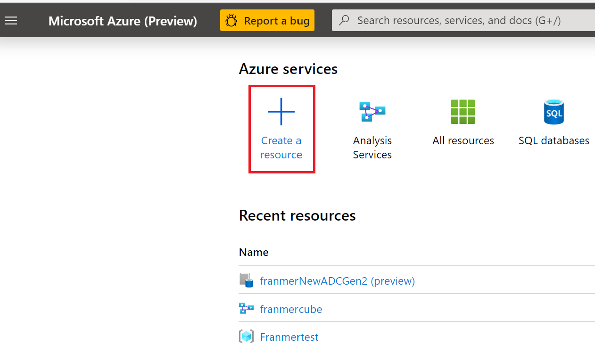

# Azure Data Factory et procedure stockée (Azure SQL Database)

In a project with a client, one step was to transform files, deposited in blob storage, using an existing stored procedure, and then move the result to an "Azure Files" storage. I found it interesting to use the copy activity with a stored procedure sourced.

This article aims to share the different steps to achieve this transformation pipeline and the various tricks used to carry out this part of the project.


## Prerequisite

- [An Azure subscription](https://azure.microsoft.com/fr-fr/free/)
- [Azure Storage Explorer](https://azure.microsoft.com/en-us/features/storage-explorer/) 


# Creating Azure services
## Resource group
We will start by creating a group of resources to host the different services of our solution.

From [Azure portal](https://portal.azure.com), click "**Create a resource**"



 Then, look for "**Resource group**"

 


Click "**Create**"


In the "**Resource group**" field, give a name to your resource group. Click on the "**Review + Create**" button


In the validation screen, click on the "**Create**" button


Return to the Azure portal home. Click on the burger menu at the top left then on "**Resource groups**"


Click on the resource group created previously


## Azure Storage account

Once in the resource group, click the button  "**Add**"


Search for storage account 


Click "**Create**"


Complete the account storage creation and click "**Review** + **create**"


After checking the storage account creation information, click the button "**Create**"


## Azure SQL database creation
Here we will create a database only to host and execute our stored procedure. So, if you wish, you can use an existing Azure database.

Go back to the resource group. You must have your storage account as your first resource.

Click "**Add**"


Then, look for "**Azure SQL**" 


Click **Create**


Select **SQL Database** then click **Create**


Choose the previously created resource group, set the name of the database and create a new SQL server (it's also possible to use an existing server)

A **"Basic"** tier will be more than enough for our demonstration

Click **"Review + create"**


Click **"Create"**


After deploying your Azure SQL database and Azure SQL server you need to have 3 services in your resource group


## Azure Data Factory (ADF)

In your resource group, click **" + Add"**


In the search bar enter **"Data Factory"**


Then click **"Create"**


Make sure you've selected the right resource group and name your ADF service.

Select **"V2"**

Click **"Next: Git configuration "**


Check the **"Configure Git Later"** box and click **"Review + create"**


In the validation page, click**"Create"**


After creating the Azure Data Factory service, you should have 4 services in your resource group


## Preparing the stored procedure

In our example, the stored procedure will read data in blob storage and perform transformations. The transformations made here will be extremely basic. The aim here is to illustrate the use of procedures stored with Azure Data Factory.

### Azure SQL server setting

Set up the Azure SQL server Firewall so you can connect to it with tools like SQL Server Management Studio or Azure Data Studio

From the Azure portal, select your Azure SQL server, then click **"Firewalls and virtual networks"**

Enter the necessary ip addresses.


After setting up ip addresses, click the button **"Save"**


### File format creation process

The stored procedure will use the function [OPENROWSET](https://docs.microsoft.com/en-us/sql/t-sql/functions/openrowset-transact-sql?view-sql-server-ver15). And because we want to retrieve the information from the file in order to do data operations, we need to define a [format file](https://docs.microsoft.com/en-us/sql/t-sql/functions/openrowset-transact-sql?view-sql-server-ver15)..

The format of the files we will process for this example is very simple. It consists of 3 columns:

- Name
- First Name
- Sale

The creation of the format file will be done in 3 steps

- Creating a SQL table that matches the file format
- Using the BCP tool to create the format file
- Download the file to the storage account


#### SQL Table creation

With [Azure Data Studio](https://docs.microsoft.com/en-us/sql/azure-data-studio/download-azure-data-studio?view-sql-server-ver15), connect to your Azure SQL database, and then create a new SQL file with a combination of **"Ctrl"** and **"N"** keys.


Then copy the script below. Click on the **"Play"** button


```Javascript
CREATE TABLE [dbo].[MyFirstImport](
	[LastName] [varchar](30) NULL,
	[FirstName] [varchar](25) NULL,
	[Sales] [int] NULL
) ON [PRIMARY]
GO
```


If all goes well you should have the following message and access to your table via the menu on the left


#### Création du fichier de format

Make sure you have the latest version of the BCP tool. For this example, I used [version 15](https://docs.microsoft.com/en-us/sql/tools/bcp-utility?view-sql-server-ver15).

To make sure you're using the right version of the BCP tool, go to the installation directory. In my case the directory is:

C:\Program Files\Microsoft SQL Server\Client SDK\ODBC\170\Tools\Binn

Then use the following command (I have a **"Temp"** directory on my C drive)

```javascript

bcp dbo.MyFirstImport format nul -c -x -f C:\Temp\format.xml -t, -U <Your User> -S tcp:<Your Server Name>.database.windows.net -d <Your Database name> -P <Your Password>

```

See below:


You need to get the format file in the specified directory with the BCP command


#### Download the format file in the Azure storage account

From the Azure portal, go to your storage account


Click **"Containers"**


And click **"+ Container"**


Give a name and click **"Create"**


We will create a directory for our format file.

Click on **"Storage Explorer (preview),"** select the container created previously, and then click **"New Folder"**


Name the directory and click the button **"Ok"**


Click the **"Upload"** button and download the format file previously created with the BCP function.


The file is ready


### Azure File setup

From the Azure portal, select your storage account and click **"File shares"**


Click **"+ File share"**


Give your file sharing a name and then click the button **"Create"**


You should get a result similar to the screen copy below:


## Stored procedure

Our stored procedure will read files that are in our storage account and perform operations on the data it will recover.

Preliminary steps are therefore needed to allow the stored procedure to access the storage account.

- Creating a shared access signature (storage account) [(Documentation)] (https://docs.microsoft.com/en-us/azure/storage/common storage-sas-overview)

- Creating a database master key [(Documentation)](https://docs.microsoft.com/en-us/sql/t-sql/statements/create-master-key-transact-sql?view-sql-server-ver15)

- Creating credentials to access the storage account [(Documentation)](https://docs.microsoft.com/en-us/sql/t-sql/statements/create-database-scoped-credential-transact-sql?view-sql-server-ver15)

- Creating an external source [(Documentation)]) (https://docs.microsoft.com/en-us/sql/t-sql/statements/create-external-data-source-transact-sql?view-sql-server-ver15)


### Creating a shared access signature (Storage Account)

From the Azure portal, go to your storage account and click **"Shared Access Signature."**

Set the options for the shared access signature and then click the **"Generate SAS and connection string"** button.


Copy the contents of the field **"SAS Token"** and then keep it on hand, we'll need it a little bit later.


### Database master key creation (Azure SQL)

From Azure Data Studio, copy the query below:

```javascript
CREATE MASTER KEY ENCRYPTION BY PASSWORD='<EnterStrongPasswordHere>';

```

Then click the button **Run**


### Creating credentials to access the storage account

From Azure Data Studio, run the script below:

**"WARNING!!!! "** Remove the sign **"?"** After copying your shared access signature.

```javascript
CREATE DATABASE SCOPED CREDENTIAL AccessAzureStorage
WITH
  IDENTITY = 'SHARED ACCESS SIGNATURE',
  -- Remove ? from the beginning of the SAS token
  SECRET = '<YOUR SHARED ACCESS SIGNATURE>' ;

```

For clarity, here's a screenshot


### Creating credentials to access the storage account

From Azure Data Studio, run the script below:

```javascript
CREATE EXTERNAL DATA SOURCE AzureStorageExternalData
WITH
  ( LOCATION = '<YOUR LOCATION>' ,
    CREDENTIAL = AccessAzureStorage ,
    TYPE = BLOB_STORAGE
  ) ;

```

Replace <YOUR LOCATION> with your container path. This information can be found in the Azure portal, in the container's properties


Below is a screenshot in Azure Data Studio:


### Creating the stored procedure

In Azure Data Studio, copy the script below:

```javascript
CREATE PROCEDURE Franmer
       @MyFileName nvarchar(MAX)
AS
BEGIN
       declare @query nvarchar(MAX)
       set @query = 'Select LastName, sum(Sales) as TotalSales FROM OPENROWSET(BULK ''' + @MyFileName + ''', 
       DATA_SOURCE = ''AzureStorageExternalData'',
       FORMAT=''CSV'',
       FORMATFILE=''Format/format.xml'',
       FORMATFILE_DATA_SOURCE = ''AzureStorageExternalData'') as products
       GROUP BY LastName;'
 
       EXEC sp_executesql @query
 END

```


It is possible to test the stored procedure by downloading the sample file (which is in the [github](https://github.com/franmer2/ADFandStoredProcedProcedure/blob/master/Resources/test.csv)) at the root of the container.


Then in Azure Data Studio, enter the script below:

```Javascript
EXECUTE franmer @MyFileName='test.csv'
```

If everything goes according to plan, you should get the following result:


## Azure Data Factory Pipeline

From the Azure portal, find your Azure Data Factory service, then click **"Author & Monitor"**


## Linked services création
### Azure Blob storage linked service

Once on the Azure Data Factory homepage, click the **"Manage"** button to the left of the screen


Click on **"Linked services"** and then on the **"New"** button  


In the list of related services, select **"Azure Blob Storage"**


Name the linked service, select the storage account and then test the connection by clicking on **"Test connection"** (1). Once the test is successful, click the **"Create"** button (2).


### Azure File Storage linked service

Create a new  **"Azure File Storage"** linked service


Then complete the login information


### Azure SQL Database linked service

Finally, create an **"Azure SQL Database"** linked service


Then complete the login information


You should have 3 linked services


## Pipeline creation

Below is a global view of the pipeline we're going to create 


### Datasets
#### Blob Storage Dataset

We'll start by creating our "Datasets" to access our stored procedure, our "blob storage" and our "file storage"

In the Azure Data Factory console on the left, click the **"Dataset"** button


Choose an **"Azure Blob Storage"** Dataset and click **"Continue"**


Choose the format **"DelimitedText"** and then click the **"Continue"** button.
(You can't choose the binary type because the source must also be of the binary type. Now the copying activity that we will do in our pipeline will have a procedure stored as a source)


Enter your blob storage information and click the button **"OK"**


Once the Dataset is created, click **"Parameters"** and then the **"New"** button. Give the setting a name. Here I'm going to name my setting "FileName"


Click on the **"Connection"** tab, then in the field **"File"**. Then click on the link **"Add dynamic content"**


The **"Add dynamic content"** component appears. Add the following expression:


```Javascript
 @dataset().FileName 
```

 Click the **"Finish"** button


 Our first Dataset is ready. Click the **"Publish all"** button and publish the dataset


#### Azure File Storage Dataset

In the Azure Data Factory console, on the left, click **"+"** and then click **"Dataset"**


Choose **"Azure File Storage"** Dataset and then click the **"Continue"** button.


Choose the format **"DelimitedText"** and then click the **"Continue"** button.


Entrez les informations de votre stockage *"file"* puis cliquez sur le bouton **"OK"**

Enter your **"Azure File Storage"** information and click  **"OK"**


Once the Dataset is created, click **"Parameters"** and then the **"New"** button 3 times to create 3 settings. Give the settings a name 


Click on the **"Connection"** tab, then in the field **"File"**. Then click on the link **"Add dynamic content"**


The **"Add dynamic content"** component appears. Add the following expression

```Javascript
 @concat(dataset().Prefix,'-',dataset().Date,'-',dataset().Name,'.csv')
 ```
 
Click **"Finish"**


Click **"Publish all"**


#### Azure SQL Database dataset

In the Azure Data Factory console on the left, click the button **"+"** then click **"Dataset"**


Select **"Azure SQL Database"** dataset then click **"Continue"**


Fill your Azure SQL information then click **"OK"**


Click **"Publish"**


### Pipeline's activities

From the Azure Data Factory portal, click the button **"+"** then click **"Pipeline"**


At your pipeline level, create a new parameter. In the **"Parameters"** tab. Click the **"New"** button and then give the parameter a name 


Then click on the **"Variables"** tab to add a variable to capture the date. Click the **"New"** button and then give the variable a name


Because we have a functional constraint on file names, which must have the date in its name, we need to capture it at the beginning of the pipeline to ensure that we have the same value during the pipeline's execution.

In addition, since the destination of the copy is an Azure File Storage, the date will have to be formatted in order to keep only characters supported by Azure File Storage.


Add a **"Variable Set"** activity to your pipeline, which is in the **"General"** section. Then click on the **"Variables"** tab. Choose the variable **"Date"** in the drop-down list, click in the **"Value"** field, and click **"Add dynamic content"**


In the **"Add dynamic content"** section, add the function 

```Javascript
@formatDateTime(utcnow(),'yyyy-MM-ddTHH-mm-ss')
```


Click **"Finish"**


From the **"Activities"** component, in the **"Move and transform"** section, add the **"Copy data"** activity to your pipeline right after the activity **"Set variable 1"** 


Click on the **"Source"** tab. In the drop-down list **"Source Dataset"** select your **"Dataset"** Azure SQL. Then click **"Stored pocedure"** and select your procedure stored in the drop-down list **"Name"**.

Then click the **"Import parameter"** button to retrieve the stored procedure setting. Click in the **"Value"** field to show the link **"Add dynanic content"**. Click on this link.


In the **"Add dynanic content"** section, add the following expression:  

```Javascript
@pipeline().parameters.FileName
```


Click **"Finish"**.


Click on the **"Sink"** tab. In the drop-down list **"Sink dataset,"** select the dataset from **"File storage."** For each setting, add the following values, each time by clicking on the link **"Add dynamic content"**

For **"Prefix"** parameter add the following expression: 

```Javascript
@pipeline().parameters.FileName
```

For **"Date"**:

```Javascript
@variables('Date')
```


For the setting **"Name"** add the expression you want. Here to illustrate this example I will simply put the value **"MonParametre"**.


Here's what the **"Sink"** part of the copy activity will give:


Finally, we're going to add a **"Delete"** activity

From the **"Activities"** section, in the **"General"** section, add the **"Delete"** activity to your pipeline


Click on the **"Source"** tab. Select the blob storage dataset. Click in the **"value"** field, which corresponds to the setting, and then click on **"Add dynamic content."**


In **"Add dynamic content"** , add the following expression:

```Javascript
@pipeline().parameters.FileName
```

Click **"Finish"**


Click on the **"Logging settings"** tab to disable logging by unchecking the **"Enable logging"** box. We're not going to need it for this example.


Click **"publish"**


#### Add a trigger


We will now add a trigger so that the pipeline will trigger as soon as a new file arrives.

Click on **"Add trigger"** then on **"New/Edit"**


In the **"Add trigger"** window, in the drop-down list, click **"New"**


Dans la rubrique **"Type"** sélectionnez **"Event"**. Puis donnez les informations de connexion à votre compte de stockage. Comme nous allons surveiller l'arrivée des fichiers à la racine du conteneur, nous allons laisser le champ **"Blob path begins with"** vide.

In the **"Type"** section, select **"Event."** Then give the login information to your storage account. As we will monitor the arrival of files at the root of the container, we will leave the field **"Blob path begins with"** empty.

=======================================

**"WARNING!!!** The trigger will monitor the entire container, which means that if a csv file arrives in a sub-file, the pipeline will be triggered.
In case you want to monitor a particular folder, and thus isolate file processing in a specific area of your container, you can simply put the name of the directory to be monitored). 


=======================================


In **"Blob path ends with"** field, we will indicate the extension of the files we want to process. Here we will set **".csv"**


Click on **"Blob created"** in the **"Event"** section. Click the **"Continue"** button


If you already have csv files in your storage account, they should be displayed in this window. It's also a good way to check the syntax used in the fields **"Blob path begins with"** and **"Blob path ends with"** from the previous pane.

Click the **"Continue"** button.


In the trigger run setting, it is possible to set a value to the parameter of our pipeline. This is what we will do with the following expression:

```Javascript
@trigger().outputs.body.fileName
```

Click **OK"**


Then publish the pipeline by clicking on the **"Publish all"** button.


### Test du pipeline

Download the sample file in your Blob container. For example with Azure Storage Explorer


Then go to your file storage to check if a file is present with the right nomenclature in its name


Also check if the file has been erased from blob storage at the end of pipleine execution


On the Azure Data Factory portal, you can monitor trigger and pipeline executions by going to **"Monitor"** and then **"Trigger runs"** or **"Pipeline runs"**

Below is an example of trigger monitoring


If you need to test your pipeline without using the trigger, it's possible to stop it by going to **"Manage"**, **"Triggers"** and then clicking **"Deacticate"**

